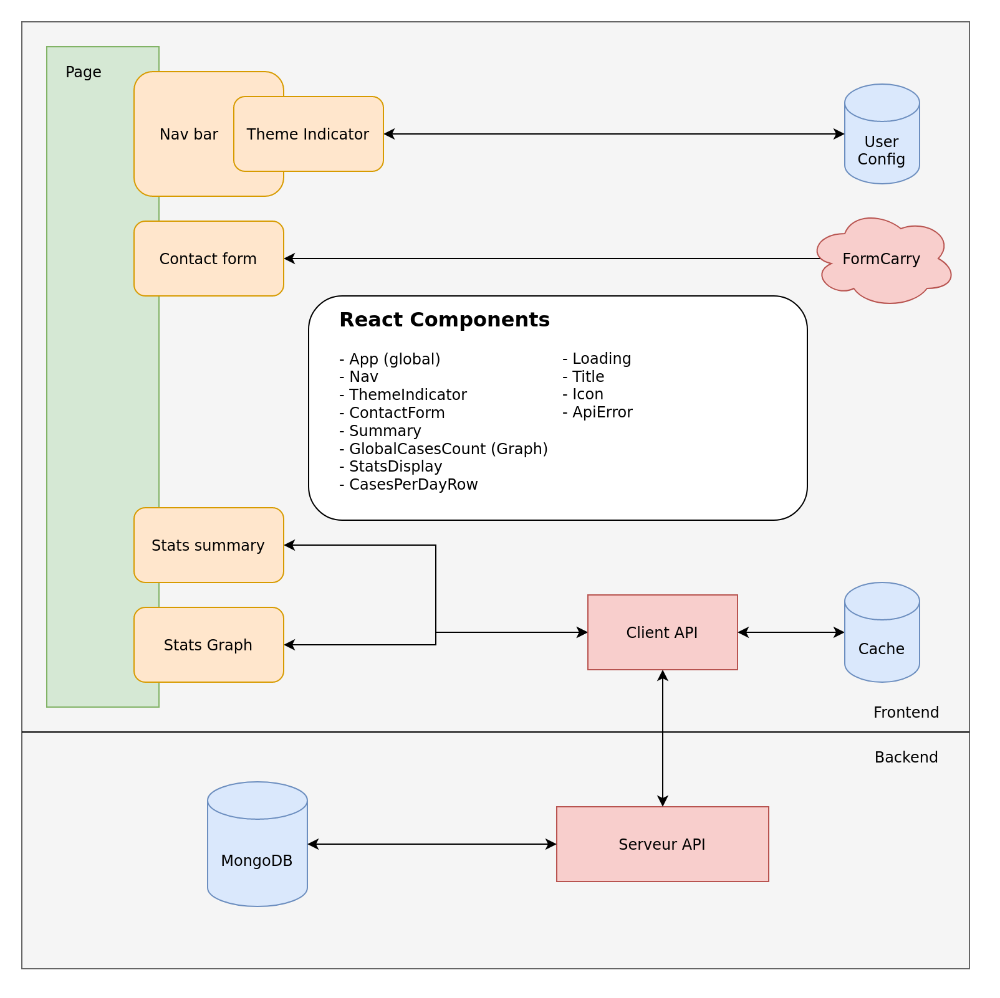

# Project covid machin

## Consignes backend

The project involves using data from a public database of disease data, see Santé public France. A couple of interesting
databases on this page are:

* Données hospitalières relatives à l'épidémie de COVID-19
* Taux d'incidence de l'épidémie de COVID-19
* Well, actually they're all interesting!

The data is given as .csv files. One of the first jobs will be to store this data into a Mongo database. This can be
installed locally on your machine or, preferably, somewhere in a cloud.

Then you'll have to come up with something interesting to do with the data. Here's just a couple of quick ideas:

* a graphical display with: abscissa is a timeline from the starting date to the present date and the ordinate is any
  one of hospitalizations, deaths, excess deaths, incidence level, etc.
* the abscissa would also mark significant events, such as: beginning of lock-down, closing of schools, end of
  lock-down, beginning and end of curfew, holidays, etc. In fact, anything that might have an impact on the transmission
  of the disease.
* there's also a behavioral survey database which could be used to graph mask-wearing against the progress of CV. Also
  other behavioral factors.
* the data is per department, per region. This could be interesting to plot, eg, on a 3-D graph of France where the
  height of a dept corresponds to some CV measure. Or a colour, this would be easier.
* a time-graph where the length of bar associated to a dept evolves over time, where the highest-something level dept
  keeps moving to the top.
* can you determine the R-value from the data?
* can you use past data to predict where we'll be in a week from now?
* etc. Up to your imagination...

## Consignes frontend / features

### Fonctionnalités

- Visualisation : Afficher les données en mode
	- liste (Table)
	- graph
- Filtres : Offrir la possibilité d'affiner les résultats avec des filtres Exemples : ville, département, tranche d’âge
- Thème : Possibilité pour l'utilisateur de changer le thème de l'application aux moins deux thèmes (un light et un
  dark) (exemple thème twitter)
  Le choix sera sauvegardé, si je recharge la page le thème est le même. Si le thème du système d'exploitation de l'
  utilisateur et que le navigateur supporte l'API (match-media prefers-color-scheme) est en mode dark automatiquement
  proposé de changer de thème (via une modal)
- HTML5 : Utilisé l'API du navigateur pour détecter la région et afficher les statistiques correspondantes
- Afficher le nombre de cas confirmés en france par exemple (sur toutes les pages) rafraîchi régulièrement

### Bonus

- Authentification simple (Basic auth ou jwt) login / mot de passe pour accéder à l'application
- Déployer l'application (il existe pas mal de solutions gratuites Heroku, AWS Free tiers etc...)
- Formulaire de contact avec envoi d'email et validation des champs•Code splitting (Lazy import)
- etc...

### Contraintes

- Responsive (l'affichage et les fonctionnalités s'adaptent au différentes tailles d'écran)
- Si possible pas de typescript
- Gestion des requêtes (erreurs, loading: spinners)
- Une Single Page App avec un routeur (exemple react-router ou équivalent) pour la gestion des différentes pages
- Utiliser au moins une API HTML5 (exemple la localisation du navigateur)
- Validation des champs des éventuelles formulaires côté clientpar exemple sur le formulaire de contact si l'email est
  incorrect, le signaler et empêcher la soumission du formulaire.
  
### Organization of the project (server side)

Thibaut michael and arnaud took care of the data processing part.

Diane did the integration of the data processing requests into the server she developed.
